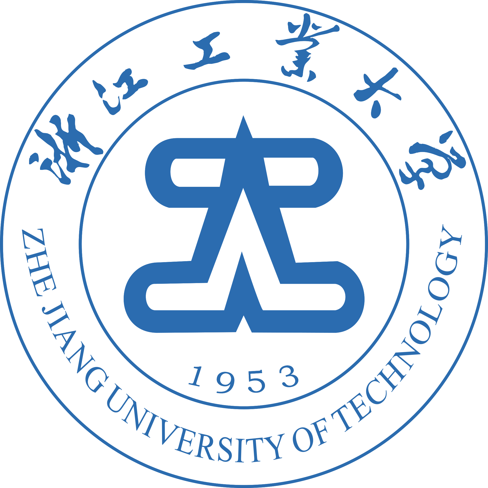

# 欢迎！
!!! shadow ""
     
    
    

        浙江工业大学
    

    

        『 Python与人工智能 』
    

    

       课程资源平台
    

     
!!! section "本站介绍"
    这里是浙江工业大学公共课——Python与人工智能课程资源平台，为浙江工业大学学生提供课程相关的资源。其中包含了课程的入门教程、课本代码、课后习题、课件等。

!!! advice "推荐阅读"
    - [Anaconda环境配置(命令行)](./start_guide/anaconda/anaconda_env.md)
    - [Jupyter Notebook教程](./start_guide/jupyter_notebook/jupyter_notebook.md)
    - [关于](./about/about.md)

!!! definition "欢迎贡献"
    我们欢迎任何形式的贡献，包括但不限于：

    - 入门教程文档撰写与修订
    - 课后练习题解贡献
    - 网站页面优化
    - 对平台建设的其他建议

