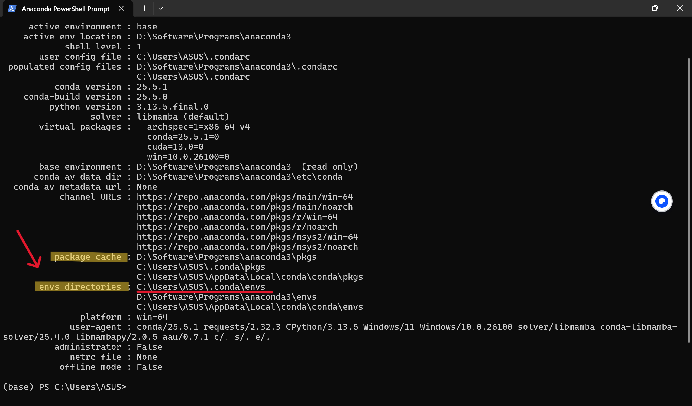
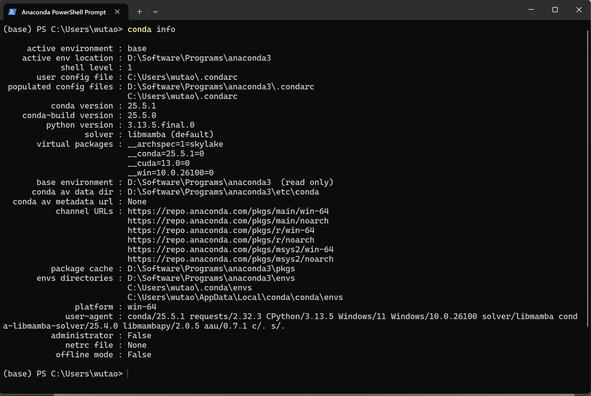

# Anaconda 环境配置

## 什么是Anaconda

Anaconda 是一个用于科学计算的 Python 发行版，它可以帮助你轻松管理多个Python环境和各种依赖包。其核心价值在于通过 Conda 解决了环境管理和依赖管理的难题，并通过预装大量库提供了开箱即用的便利性，让开发者能够专注于解决问题本身，而不是浪费在配置环境上。<span style="color: #888">（该内容由deepseek生成）</span>

## 下载和安装

1、进入anaconda官网：<https://www.anaconda.com>

2、点击右上方Free Download下载

3、点击右框下方的Skip registration跳过登录注册，进入下载界面

4、点击左侧Distribution Installers下方的Download（Windows图标或Download for Windows）
!!! note "注意"
    - 不要点右侧Miniconda Installer下的Download键，我们需要的是anaconda而不是miniconda
    - 如果点击下载后无法加载出下载项，则需科学上网或者使用清华镜像源（初学推荐）
    - 清华镜像源网站：<https://mirrors.tuna.tsinghua.edu.cn/anaconda/archive/?C=M&O=D>

<div class="gallery">
  <div class="gallery-item" data-src="../1.png" data-caption="步骤1、2">
    
    <div class="caption">步骤1、2</div>
  </div>
  <div class="gallery-item" data-src="../2.png" data-caption="步骤3">
    
    <div class="caption">步骤3</div>
  </div>
  <div class="gallery-item" data-src="../3.png" data-caption="步骤4">
    
    <div class="caption">步骤4</div>
  </div>  
  <div class="gallery-item" data-src="../4.png" data-caption="清华镜像源安装">
    
    <div class="caption">清华镜像源安装</div>
  </div>
</div>

5、提示下载成功后打开下载的exe文件。

点击Next开始、I Agree同意协议、选择All Users全局安装。

选择安装路径：选择自己安装软件的盘和文件夹，这里用D盘做示例。

!!! note "注意"
    - 这里一定不要装在C盘（系统盘）！，后面安装的各种工具包全部都存放在软件的文件夹中，C盘空间会不够用！不知道应该怎么存放的可以看一下电脑系统基础教程。
    - 切记在选择文件路径之后确保末尾是anaconda3，这样软件所有的文件都会放在annaconda3这个文件夹中，否则将全部摊开在上级目录里（图中programs文件夹中）。

Advanced Installation Options选择下图中的这三项（如有四项也只选择这三项），然后点击Install完成安装。时间可能会比较长，请耐心等待。

<div class="gallery">
  <div class="gallery-item" data-src="../5.png" data-caption="安装路径">
    
    <div class="caption">安装路径</div>
  </div>
  <div class="gallery-item" data-src="../6.png" data-caption="安装选项">
    
    <div class="caption">安装选项</div>
  </div>
</div>

6、检验安装。从开始界面应用菜单栏找到Anaconda PowerShell Prompt打开，输入以下命令。可以看到安装的conda版本号即代表成功安装。

```PowerShell title="查看conda版本" linenums="1"
conda --version
```

<div class="gallery">
  <div class="gallery-item" data-src="../7.png" data-caption="打开Anaconda PowerShell">
    
    <div class="caption">打开Anaconda PowerShell</div>
  </div>
  <div class="gallery-item" data-src="../8.png" data-caption="检验安装">
    
    <div class="caption">检验安装</div>
  </div>
</div>

## 虚拟环境创建

### 什么是虚拟环境

Anaconda中的虚拟环境是一个独立的隔离空间，允许你为不同项目创建和管理互不干扰的Python运行环境。其核心作用是解决项目间库版本和依赖的冲突问题，确保每个项目都能拥有自己稳定的依赖库集合，从而保证项目的可移植性和复现性。<span style="color: #888">（该内容由deepseek生成）</span>

### 如何创建虚拟环境

#### 前置操作

##### 修改默认存储路径

现在我们已经将软件装在了D盘之中，在Anaconda PowerShell Prompt中输入以下命令来查看环境和工具包的存放路径

```PowerShell title="查看存放路径" linenums="1"
conda info
```

我们可以看到以下结果：



可以看到，envs directorier（环境目录）显示在C盘要将它移动到D盘中。每个选项后面的第一行路径为优先存放的路径，我们需要将第一行的路径改成我们想要的。

1、在Anaconda PowerShell Prompt中输入命令，生成.condarc文件（第一次使用，可能不存在）

```PowerShell title="生成.condarc文件" linenums="1"
conda config --set show_channel_urls yes
```

2、在C:\Users\（自己的用户名）文件夹下找到.condarc文件，用记事本打开

3、将文件中的内容替换为以下内容并保存。

!!! note "注意"
    在设置路径时，\envs和\pkgs前的路径（标红）根据自己安装的路径来填写，不要直接复制！

```.condarc title="修改.condarc文件内容" linenums="1"
channels:
  - defaults
envs_dirs:
  - D:\Software\Programs\anaconda3\envs 
show_channel_urls: true
```

4、保存好修改的文件后，再次输入conda info命令查看修改后的路径。可以看到现在envs directorier的路径显示在D盘了。



##### 修改镜像源

!!! note "注意"
    - 如果有梯子且网速较快可以完全不用做这一步。若翻墙后下载时网速依然很慢，强烈推荐方案一。
    - **不推荐方案二，有些库可能在清华镜像源中没有，会下载失败。**

因为线路的限制，使用 Anaconda 的默认源下载速度过慢，可以更换国内的镜像源来提升下载速度。常用的是清华镜像源。

**方案一：在下载命令后添加后缀（推荐）**

```PowerShell title="需要添加的后缀" linenums="1"
-i https://pypi.tuna.tsinghua.edu.cn/simple
```

优点：根据镜像内容和下载速度可以灵活选择不同的镜像源

缺点：每次下载都要在后面添加一次，过于繁琐

​**方案二：修改.condarc设置**​**（非常不推荐）**

在之前修改的基础上，增加镜像源配置，将整个文件改为如下所示：

```JSON title="修改.condarc设置" linenums="1"
channels:
  - defaults
envs_dirs:
  - D:\Software\Programs\anaconda3\envs
show_channel_urls: true
default_channels:
  - https://mirrors.tuna.tsinghua.edu.cn/anaconda/pkgs/main
  - https://mirrors.tuna.tsinghua.edu.cn/anaconda/pkgs/free
  - https://mirrors.tuna.tsinghua.edu.cn/anaconda/pkgs/r
  - https://mirrors.tuna.tsinghua.edu.cn/anaconda/pkgs/pro
  - https://mirrors.tuna.tsinghua.edu.cn/anaconda/pkgs/msys2
custom_channels:
  conda-forge: https://mirrors.tuna.tsinghua.edu.cn/anaconda/cloud
  msys2: https://mirrors.tuna.tsinghua.edu.cn/anaconda/cloud
  bioconda: https://mirrors.tuna.tsinghua.edu.cn/anaconda/cloud
  menpo: https://mirrors.tuna.tsinghua.edu.cn/anaconda/cloud
  pytorch: https://mirrors.tuna.tsinghua.edu.cn/anaconda/cloud
  simpleitk: https://mirrors.tuna.tsinghua.edu.cn/anaconda/cloud
```

优点：全局设置，之后下载默认使用清华镜像源，不需要加后缀

缺点：若镜像源提供方无对应镜像源或法继续提供镜像源，则需重新修改配置文件

接下来开始创建虚拟环境

#### 方法一：用命令行创建

##### 基本说明

打开Anaconda PowerShell Prompt，可以看到（base）PS （当前的路径），其中base就代表你现在所在的环境，在当前环境下，安装的解释器或工具包都只存在与当前环境中，离开当前环境中则无法调用。

例如在base环境下输入命令安装python，则python只能在base下运行，进入其他环境或者在系统目录下则无法运行。

Anaconda默认的环境是base，一般不在其中开展项目。应根据自己的需求创建一个新的环境。


##### 创建环境

在命令行中输入创建命令。

AI_learning：创建的虚拟环境的名称，可以替换

python=3.11：将python3.11安装在环境中

```PowerShell title="创建虚拟环境" linenums="1"
conda create --name AI_learning python=3.11
```

如下图，等待一段时间后 会显示即将安装的包，需要输入y后回车确认开始安装（n是取消安装）。需等待一段时间，看到done即完成安装。

<div class="gallery">
  <div class="gallery-item" data-src="../12.png" data-caption="安装环境命令">
    
    <div class="caption">安装环境命令</div>
  </div>
  <div class="gallery-item" data-src="../13.png" data-caption="完成安装提示">
    
    <div class="caption">完成安装提示</div>
  </div>
</div>

##### 环境激活

创建环境之后，需要对环境进行激活，进入到环境下。

在命令行输入命令，激活名为AI_learning的环境。

```PowerShell title="激活虚拟环境" linenums="1"
conda activate AI_learning
```

可以看到现在前面部分由（base）变为了（AI_learning），说明我们已经进入环境中，接下来的操作都在该环境中进行。

一般来说，此时执行安装工具包命令时，工具包都会安装在这个环境的文件夹中（之前操作中设置的环境存放路径）。

此时（AI_learning）PS 后面的路径仍然是默认路径C:\Users\（你的用户名），相关的文件操作仍会在默认文件夹下进行。我们需要建一个文件夹来存放自己的项目文件（例如我现在在D:\Project下创建了名为AI_learning的项目文件夹），并通过输入以下命令进入到项目文件夹，接下来的文件操作都会在该目录下进行。

```PowerShell title="进入项目文件夹" linenums="1"
cd D:\Project\AI_learning
```

<div class="gallery">
  <div class="gallery-item" data-src="../14.png" data-caption="激活虚拟环境">
    
    <div class="caption">激活虚拟环境</div>
  </div>
  <div class="gallery-item" data-src="../15.png" data-caption="进入项目文件夹">
    
    <div class="caption">进入项目文件夹</div>
  </div>
</div>

##### 更多操作

查看所有虚拟环境

```PowerShell title="查看环境列表" linenums="1"
conda env list
```

（待补充）

<div class="gallery">
  <div class="gallery-item" data-src="../n1.png" data-caption="查看本地所有虚拟环境">
    
    <div class="caption">查看本地所有虚拟环境</div>
  </div>
</div>

#### 方法二：在Anaconda图形界面创建

点击左侧目录栏Environment。点击下方Create，输入环境名称，选择python版本后即可创建，新环境会在左侧列表中出现，点击后在右侧可以查看和管理该环境中已经安装的包。


## 配置环境变量

现在我们只能使用anaconda自带的命令行进行conda环境操作（必须打开Anaconda PowerShell Prompt），如果使用系统自带的命令行工具（PowerShell、cmd）则无法进行conda环境操作。通过配置系统环境变量，可以直接实现在系统命令提示行工具中进行conda环境操作。

1、打开设置，在搜索栏中输入“系统环境变量”，点击“编辑系统环境变量”

2、进入设置界面后，确认上方目录处于“高级”中，然后点击右下方“环境变量”

3、点击选中下方“系统变量”栏目中的Path，点击下方“编辑”

4、在新跳出的页面中点击“新建”，输入电脑中Anaconda安装的位置路径（例如图中D:\\Software\\Programs\\anaconda3）和在软件位置路径的后方加上Scripts后缀的路径（例如图中D:\\Software\\Programs\\anaconda3\\Scripts）
!!! note "注意"
    **这里路径一定要改成自己电脑上的路径，不要直接复制！！！**

5、添加完成后点击“确定”，继续点击上级页面的“确定”，一共点三次。点击确定后，页面全部自动关闭。不要点击右上角的❌关闭，否则配置无效。

6、现在打开终端PowerShell，输入以下命令激活之前创建的虚拟环境。成功激活后输入python，若能够正常运行，则代表配置成功。之后就可以使用系统自带的PowerShell或cmd，不需要每次都打开Anaconda PowerShell Prompt或Anaconda Prompt了。

<div class="gallery">
  <div class="gallery-item" data-src="../17.png" data-caption="在设置中找到“编辑系统环境变量”">
    
    <div class="caption">在设置中找到“编辑系统环境变量”</div>
  </div>
    <div class="gallery-item" data-src="../18.png" data-caption="选择环境变量">
    
    <div class="caption">选择环境变量</div>
  </div>
    <div class="gallery-item" data-src="../19.png" data-caption="编辑系统变量中的Path">
    
    <div class="caption">编辑系统变量中的Path</div>
  </div>
    <div class="gallery-item" data-src="../20.png" data-caption="新建路径">
    
    <div class="caption">新建路径</div>
  </div>
    <div class="gallery-item" data-src="../21.png" data-caption="测试">
    
    <div class="caption">测试</div>
  </div>
</div>