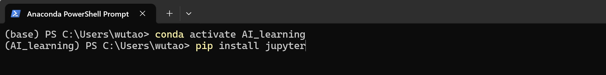

# Jupyter Notebook配置

!!! property "本文贡献者：顾武韬"

## 什么是Jupyter Notebook

Jupyter Notebook 是一款开源的交互式 Web 工具，用于创建包含实时代码、公式、可视化图表和文本说明的文档。其核心是“单元格”概念，允许用户在代码单元（支持 Python 等 40 多种语言）中编写并运行代码，结果会直接显示在下方；同时可在 Markdown 单元中用富文本和公式记录分析过程。这种将代码、结果和叙述文本结合的形式，使其成为数据探索、机器学习、科学计算和教学的理想工具，让整个工作流程如同在讲述一个逻辑清晰的故事。<span style="color: #888">（该内容由deepseek生成）</span>

## 安装 Notebook

1、进入Anaconda PowerShell Prompt，激活之前创建的conda虚拟环境

2、进入环境后，输入以下代码安装jupyter notebook

```PowerShell title="安装Jupyter" linenums="1"
pip install jupyter
```



## 启动 Notebook

1、cd进入项目文件夹中

```PowerShell title="进入项目文件夹" linenums="1"
cd D:\Project\AI_learning
```

2、在项目文件夹下启动jupyter notebook

```PowerShell title="启动Jupyter notebook" linenums="1"
jupyter notebook
```

notebook启动后，等待几秒，会自动跳转到浏览器打开。出现如下界面则成功启动。在页面中可以看到当前项目文件夹下的所有文件，如果没有文件则空白。

<div class="gallery">
  <div class="gallery-item" data-src="../2.png" data-caption="命令行启动notebook”">
    
    <div class="caption">命令行启动notebook</div>
  </div>
  <div class="gallery-item" data-src="../3.png" data-caption="自动跳转浏览器打开">
    
    <div class="caption">自动跳转浏览器打开</div>
  </div>
</div>

## 基本使用操作

### 创建新的 Notebook

1、进入我们想存放notebook文件的文件夹中（没有文件夹可以在页面中空白处点击右键选择New Folder新建）

2、点击右上角File，选择New，点击Notebook创建。创建完成后自动跳转打开新建的Notebook。

3、选择python解释器（默认为当前虚拟环境安装的python版本），点击select。这里的python解释器版本与安装jupyter notebook的虚拟环境中所安装的python版本相同，同时在当前虚拟环境中安装的各种python库也可以在Notebook中直接调用。

4、看到如图页面则代表成功创建

<div class="gallery">
  <div class="gallery-item" data-src="../4.png" data-caption="创建新的notebook”">
    
    <div class="caption">创建新的notebook</div>
  </div>
  <div class="gallery-item" data-src="../5.png" data-caption="选择Python解释器">
    
    <div class="caption">选择Python解释器</div>
  </div>
    <div class="gallery-item" data-src="../6.png" data-caption="Notebook界面">
    
    <div class="caption">Notebook界面</div>
  </div>
</div>

### 单元格操作

#### 单元格类型

##### 代码单元格

输入代码的单元格。可编写、运行和测试代码，并立即查看结果

##### Markdown单元格

可输入Markdown格式文本，用于添加文本说明

有关Markdown的更多内容见：Markdown基本教程

#### 新建单元格

**​方法一：​**点击操作栏中的“+”

**​方法二：​**将鼠标移动到已有单元格下方，会显示click to add a cell,点击即可添加

添加新的单元格时，默认为代码单元格。如需添加Markdown单元格，点击到新建的单元格中，点击操作栏右边的Code选项，将其更改为Markdown，此时光标所在的单元格将会变为Markdown单元格

<div class="gallery">
  <div class="gallery-item" data-src="../7.png" data-caption="点击“+”新建单元格">
    
    <div class="caption">点击“+”新建单元格</div>
  </div>
  <div class="gallery-item" data-src="../8.png" data-caption="鼠标移动到单元格下方新建">
    
    <div class="caption">鼠标移动到单元格下方新建</div>
  </div>
    <div class="gallery-item" data-src="../9.png" data-caption="修改单元格类型">
    
    <div class="caption">修改单元格类型</div>
  </div>
</div>

#### 输入代码并运行

在空白的代码单元格中输入

```Python title="测试代码" linenums="1"
print("Hello world!")
```

可执行以下操作：

1、运行当前单元格: Ctrl + Enter

2、运行当前单元格并在下方创建新的单元格：Shift + Enter

<div class="gallery">
  <div class="gallery-item" data-src="../10.png" data-caption="在单元格中输入代码">
    
    <div class="caption">在单元格中输入代码</div>
  </div>
  <div class="gallery-item" data-src="../11.png" data-caption="Ctrl + Enter 运行当前单元格">
    
    <div class="caption">Ctrl + Enter 运行当前单元格</div>
  </div>
  <div class="gallery-item" data-src="../12.png" data-caption="Shift + Enter 运行当前单元格并在下方创建新的单元格">
    
    <div class="caption">Shift + Enter 运行当前单元格并在下方创建新的单元格</div>
  </div>
</div>

#### 输入Markdown并编译

1、新建空白单元格，将单元格类型改为Markdown

2、输入以下内容（#代表一级标题）

```Markdown title="测试代码" linenums="1"
# 这是标题
```

3、Ctrl + Enter或Shift + Enter运行当前单元格，可以看到刚才输入的内容出现格式

4、如需修改，双击生成后的文字单元格即恢复到可输入状态

<div class="gallery">
  <div class="gallery-item" data-src="../13.png" data-caption="修改单元格类型为Markdown">
    
    <div class="caption">修改单元格类型为Markdown</div>
  </div>
  <div class="gallery-item" data-src="../14.png" data-caption="输入Markdown格式内容">
    
    <div class="caption">输入Markdown格式内容</div>
  </div>
  <div class="gallery-item" data-src="../15.png" data-caption="运行后产生格式">
    
    <div class="caption">运行后产生格式</div>
  </div>
</div>

#### 删除单元格

方法一：点击单元格右侧删除图标

方法二：点击单元格中内容输入框外的空白处（图中箭头所指位置）选择当前单元格，双击"D"键

如果只有一行单元格，删除后会自动新建一行空白的。

<div class="gallery">
  <div class="gallery-item" data-src="../16.png" data-caption="方法一">
    
    <div class="caption">方法一</div>
  </div>
  <div class="gallery-item" data-src="../17.png" data-caption="方法二">
    
    <div class="caption">方法二</div>
  </div>
</div>

#### 在上下方插入新的单元格

方法一：点击单元格右侧图标，左边的为在上方插入，右边的为在下方插入

方法二：选中整个单元格（点击单元格中内容输入框外的空白处），点击"A"键在上方插入，点击"B"键在下方插入

如图在python代码行上下插入新的单元格

<div class="gallery">
  <div class="gallery-item" data-src="../18.png" data-caption="方法一">
    
    <div class="caption">方法一</div>
  </div>
  <div class="gallery-item" data-src="../19.png" data-caption="在程序上下方插入效果">
    
    <div class="caption">在程序上下方插入效果</div>
  </div>
</div>

#### 上下移动单元格

方法一：点击单元格右侧图标，上箭头为向上移动，下箭头为向下移动

方法二：选中整个单元格（点击单元格中内容输入框外的空白处），点击"Ctrl + Shift + 上键"上移，点击"Ctrl + Shift + 下键”下移

如图选中python代码行对其进行上下移动操作

<div class="gallery">
  <div class="gallery-item" data-src="../20.png" data-caption="方法一">
    
    <div class="caption">方法一</div>
  </div>
  <div class="gallery-item" data-src="../21.png" data-caption="上移效果">
    
    <div class="caption">上移效果</div>
  </div>
  <div class="gallery-item" data-src="../22.png" data-caption="下移效果">
    

    <div class="caption">下移效果</div>
  </div>
</div>

学会上述步骤，就可以开始用Jupyter Notebook编写和调试代码了！

以上是最基本的操作，其他更多的功能和用法可以在使用的过程中慢慢探索。
